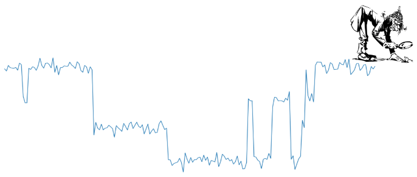

# Noise Modeling in Python



**Nomopy** is statistical software for modeling and analyzing noise signals created by discrete level fluctuators.  For details see our [paper](https://arxiv.org/pdf/2311.00084
), or look through the [code documentation](http://nomopy.readthedocs.io).

## Features

* **Factorial Hidden Markov Model**:
  - Exact E-step.
  - Mean Field Approximation E-step.
  - Gibbs Sampling E-Step.
  - Structured Variational Approximation E-step.
  - Viterbi algorithm.
* **Uncertainty Quantification**:
  - Hessian-based confidence intervals.
  - Bootstrapped confidence intervals.
* **Model Selection**:
  - Routines for cross validated model selection.
* **Higher order statistics** (HOS):
  - Second spectrum analysis.
  - Test for Gaussianity.
* **Noise models**:
  - Thermal two-level fluctuator model.  Defined using physical properties of the fluctuators (energy barrier, energy bias, etc.).
* **Optimized and Scales to HPC**:
  - Algorithms optimized using vectorization and Numba for just-in-time compilation.
  - Highly parallel workloads scale easily to HPC using Dask.

## Installation

Consider using our `environment.yml` file to install the recommended dependencies:

```shell
$ conda env create -f environment.yml
```

Then install `nomopy`:

```shell
$ pip install nomopy
```

Testing and coverage:

```shell
$ pytest --cov=nomopy --cov-report html --ignore=tests/test_numba_utilities.py
$ pytest --cov=nomopy --cov-append --cov-report html tests/test_numba_utilities.py
```
Coverage report is in `htmlcov/index.html`.

## Documentation

See full documentation [here](http://nomopy.readthedocs.io).

Some examples can be found in the [examples](examples) directory.

## Quick Example

(See the [full Jupyter notebook](examples/Quick_Example.ipynb).)

```python
from nomopy.fhmm import FHMM
```

Generate some simulated data :
```python
N = 1    # Number of time series
T = 200  # Number of samples per time series
d = 2    # Number of hidden fluctuators
k = 2    # Number of states for each fluctuator
o = 1    # Observable dimension

W, A, C, pi = FHMM.generate_random_model_params(T, d, k, o, seed=36)
C = np.array([[0.001]])  # Set low noise level

X, states = FHMM(T=T, d=d, o=o, k=k, W_fixed=W, A_fixed=A, C_fixed=C, pi_fixed=pi)\
                .generate(N, T, return_states=True)
# X has shape (N, T, o)
plt.plot(X[0, :, 0])
```


Fitting a FHMM using the `exact` method:
```python
fhmm = FHMM(T=T, d=d, o=o, k=k, em_max_iter=100, method='exact', verbose=False)
fhmm.fit(X)
fhmm.plot_fit()
```


Calculate the most likely (Viterbi) hidden state trajectories:

```python
viterbi = fhmm.viterbi(0)  # Sample 0
```
```python
fig, axs = plt.subplots(2, 1, figsize=(20, 8))
axs[0].plot(viterbi[:, 0, 0])  # shape=(T, d, k)
axs[1].plot(states[0, :, 0, 0], c='r')  # shape=(N, T, d, k)
axs[0].set_ylabel('Viterbi', fontsize=15)
axs[1].set_ylabel('Actual', fontsize=15)
```


```python
fig, axs = plt.subplots(2, 1, figsize=(20, 8))
axs[0].plot(viterbi[:, 1, 0])
axs[1].plot(states[0, :, 1, 0], c='r')
axs[0].set_ylabel('Viterbi', fontsize=15)
axs[1].set_ylabel('Actual', fontsize=15)
```

