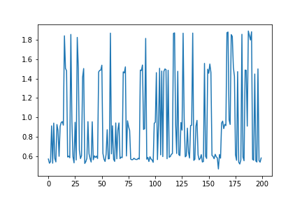
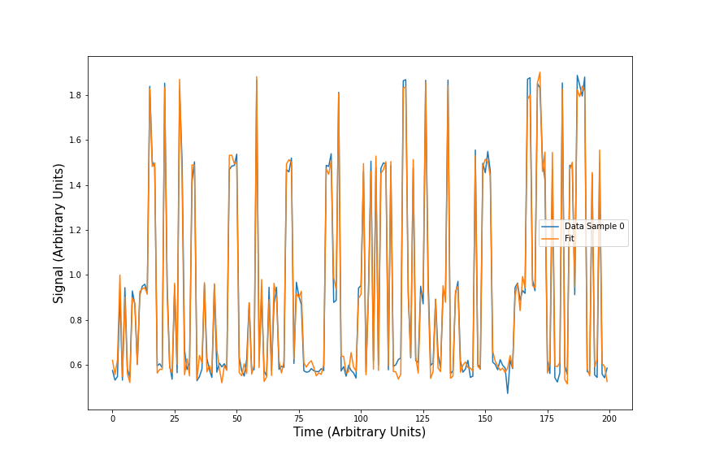
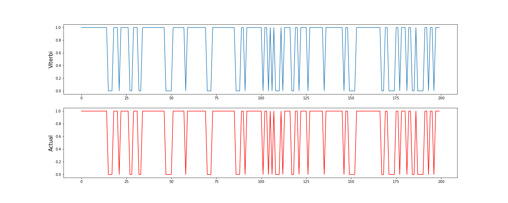
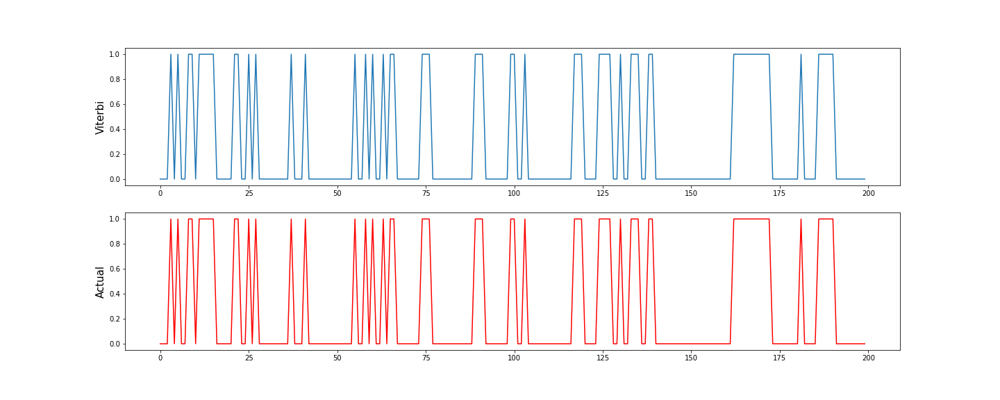

Quick Example
*************

(See the [full Jupyter notebook](examples/Quick_Example.ipynb).)

.. code-block:: python

    from nomopy.fhmm import FHMM

Generate some simulated data:

.. code-block:: python

    N = 1    # Number of time series
    T = 200  # Number of samples per time series
    d = 2    # Number of hidden fluctuators
    k = 2    # Number of states for each fluctuator
    o = 1    # Observable dimension

    W, A, C, pi = FHMM.generate_random_model_params(T, d, k, o, seed=36)
    C = np.array([[0.001]])  # Set low noise level

    X, states = FHMM(T=T, d=d, o=o, k=k, W_fixed=W, A_fixed=A, C_fixed=C, pi_fixed=pi)\
                .generate(N, T, return_states=True)
    # X has shape (N, T, o)
    plt.plot(X[0, :, 0])

    Example timeseries

Fitting a FHMM using the `exact` method:

.. code-block:: python

    fhmm = FHMM(T=T, d=d, o=o, k=k, em_max_iter=100, method='exact', verbose=False)
    fhmm.fit(X)
    fhmm.plot_fit()

    Example fit

Calculate the most likely (Viterbi) hidden state trajectories:

.. code-block:: python

    viterbi = fhmm.viterbi(0)  # Sample 0

.. code-block:: python

    fig, axs = plt.subplots(2, 1, figsize=(20, 8))
    axs[0].plot(viterbi[:, 0, 0])  # shape=(T, d, k)
    axs[1].plot(states[0, :, 0, 0], c='r')  # shape=(N, T, d, k)
    axs[0].set_ylabel('Viterbi', fontsize=15)
    axs[1].set_ylabel('Actual', fontsize=15)

    
    Inferred hidden state trajectory for fluctuator 1 as inferred by the Viterbi algorithm (above) and the true trajectory (below)

.. code-block:: python

    fig, axs = plt.subplots(2, 1, figsize=(20, 8))
    axs[0].plot(viterbi[:, 1, 0])
    axs[1].plot(states[0, :, 1, 0], c='r')
    axs[0].set_ylabel('Viterbi', fontsize=15)

    Inferred hidden state trajectory for fluctuator 2 as inferred by the Viterbi algorithm (above) and the true trajectory (below)

    Hidden state trajectory
