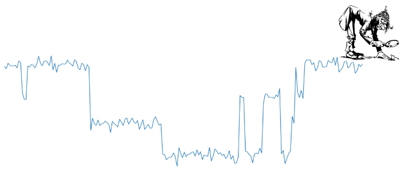

.. nomopy documentation master file, created by
   sphinx-quickstart on Sun Mar 21 23:07:59 2021.
   You can adapt this file completely to your liking, but it should at least
   contain the root `toctree` directive.

nomopy: Noise modeling in Python
==================================

Statistical software for analyzing noise in the time domain, modeled as having been generated by a factorial hidden Markov process.

Features
********

* **Factorial Hidden Markov Model**:
   * Exact E-step.
   * Mean Field Approximation E-step.
   * Gibbs Sampling E-Step.
   * Structured Variational Approximation E-step.
   * Viterbi algorithm.
* **Uncertainty Quantification**:
   * Hessian-based confidence intervals.
   * Bootstrapped confidence intervals.
* **Model Selection**:
   * Routines for cross validated model selection.
* **Higher order statistics** (HOS):
   * Second spectrum analysis.
   * Test for Gaussianity.
* **Noise models**:
   * Thermal two-level fluctuator model.  Defined using physical properties of the fluctuators (energy barrier, energy bias, etc.).
* **Optimized and Scalable to HPC**:
   * Algorithms optimized using vectorization and Numba for just-in-time compilation.
   * Highly parallel workloads scale easily to HPC using Dask.

.. toctree::
   :maxdepth: 2
   :caption: Contents:

   installation
   example
   modules

Indices and tables
==================

* :ref:`genindex`
* :ref:`modindex`
* :ref:`search`
